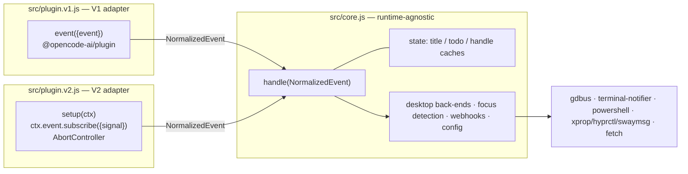

# Design — `v2-plugin-migration`

Port `opencode-notify` from the V1 plugin API (`@opencode-ai/plugin`, a single
generic `event({event})` hook) to V2 (`@opencode/plugin`, `Plugin.define({id,
setup(ctx)})` with `ctx.event.subscribe({signal})`), without regressing V1.

All V2 event shapes below were read directly from the installed
`@opencode/schema` 2.0.4 `event-manifest.d.ts` and `form.d.ts`. Facts that could
not be settled from the schema are listed under **Open questions**, not guessed.

## Scope

**Given (constraints, not re-litigated):** V1 must keep working unchanged; V1 and
V2 ship from one package; no new runtime dependencies; the plugin spawns OS
processes itself and needs no runtime shell helper.

**Problem:** V1 and V2 differ in *dispatch mechanism* (callback vs. async
iterator), in *event vocabulary* (three V1 domains have no V2 counterpart), and
in *payload shape per event*. A transport-only adapter split is therefore not
sufficient — the translation is per-event-type.

**Corrections to the proposal, from reading the schema:**

| Proposal says | Schema says |
| --- | --- |
| `session.created`/`session.updated` both exist on V2 | **No `session.updated` exists.** `session.renamed` (`data={title, sessionID}`) is the title-refresh event. |
| `session.created` has `data.title` | `data.title` is **optional**; there is **no** session-id field on `data` — the id is only in `durable.aggregateID`. |
| `form.*` payloads | `form.created` nests under `data.form` (`{id, sessionID, title, fields, metadata?}`, `title` **required**); `form.replied`/`form.cancelled` are **flat** (`data.id`, `data.sessionID`). |

Confirmed absent from V2: any `todo.*` event, any `question.*` event, any
`session.updated`, any `session.error`. `session.status`'s union is
`idle | retry | busy` — no error variant.

## Options considered

**A. Two independent plugin files, logic duplicated.** Rejected: ~1280 lines of
OS back-end and focus-detection code duplicated; every future fix needs two
edits; the two copies drift silently.

**B. Thin adapters over a shared `core.js` that consumes *raw* events**
(the `opencode-redact` pattern). Rejected: core would need a `runtime` flag and
per-event `if (v2)` branches, because the payloads differ per event type, not
just the transport. That pushes runtime knowledge into the layer whose whole
purpose is to have none.

**C. Shared `core.js` over a *normalized* event vocabulary; adapters are
stateless shape-translators. — recommended.** Each adapter maps its runtime's
raw events onto a small runtime-neutral union; core handles only that union and
never learns which runtime it is under. The runtime differences collapse into
*which normalized kinds an adapter can produce* — which is exactly how the todo
gap wants to be expressed.

Chosen: **C**. It is the only option where "V2 cannot do todos" is a statement
about one adapter rather than a conditional inside shared logic; it keeps all
mutable state in one place; and it makes the bulk of the behaviour testable with
no runtime fake at all.

## Recommended architecture

**Invariants.**

1. **Adapters are stateless.** They translate one raw event into zero or more
   `NormalizedEvent`s and return. Every cache (`sessionTitleCache`,
   `todoStateCache`, both notification-handle caches,
   `permissionRepliedEarlyCache`) lives in core. This is what keeps
   transition-detection (todo completion) and the permission race fix in one
   place instead of duplicated per adapter.
2. **Core imports nothing runtime-specific.** No `@opencode-ai/plugin`, no
   `@opencode/plugin`. Its only injected dependency is a
   `log(level, message, extra)` function.
3. **Unhandled event types cost nothing.** Adapters switch on the raw event type
   and return *before any `await`* for types they do not map.

**Entry points.** `package.json` keeps `main`/`exports["."]` → V1 (existing
installs and the `plugins/` symlink keep working with no change) and adds
`exports["./v2"]` → `src/plugin.v2.js`. Runtime auto-detection from a single
entry is rejected: the host already knows which API it loads, sniffing is
fragile, and it buys nothing (YAGNI).

### `NormalizedEvent`

A discriminated union on `kind`, named neutrally so neither runtime's vocabulary
leaks in (hence `prompt-*`, not `question-*`/`form-*`):

| `kind` | Fields | V1 source | V2 source |
| --- | --- | --- | --- |
| `session-titled` | `sessionID`, `title` | `session.created`, `session.updated` | `session.created` (title present), `session.renamed` |
| `permission-asked` | `sessionID`, `requestID`, `description` | `permission.asked` | `permission.asked` |
| `permission-replied` | `sessionID`, `requestID` | `permission.replied` | `permission.replied` |
| `todos-updated` | `sessionID`, `todos[{content,status}]` | `todo.updated` | *(never produced)* |
| `session-idle` | `sessionID` | `session.idle` | `session.idle` |
| `session-failed` | `sessionID`, `errorMessage?` | `session.error` | `session.execution.failed` |
| `prompt-asked` | `sessionID`, `requestID`, `title`, `body` | `question.asked` | `form.created` |
| `prompt-resolved` | `sessionID`, `requestID` | `question.replied`, `question.rejected` | `form.replied`, `form.cancelled` |

`todos-updated` deliberately carries the **whole todo array**, not a
pre-computed "completed" event: transition detection is stateful, and state
belongs to core.

`errorMessage` is optional so V1 (which has no message) and V2 (which has one)
share a shape. See the session-failed decision below.

### Mapping notes the implementer must not get wrong

- **V2 `session.created`:** session id is `durable.aggregateID` — there is no
  `data.id`/`data.sessionID`. `data.title` is optional; when it is absent or
  empty, emit **nothing** and let core's existing `Session <id8>` fallback
  apply (rather than inventing a `data.slug` heuristic). `session.renamed`
  then populates the cache when a real title is assigned.
- **V2 `permission.asked`:** there is no descriptive `permission` string. Compose
  `description` from `action` + `resources` (+ `message` when present), e.g.
  `"<action> <resources.join(', ')>"` with `message` appended on its own line.
  Keep it to the one- or two-line strapline a notification body can show.
- **V2 form shape asymmetry:** `form.created` reads `data.form.{id,sessionID,title,fields}`;
  `form.replied`/`form.cancelled` read `data.{id,sessionID}` — **not** `data.form.id`.
- **Webhook payloads are a public contract and do not fork per runtime.** Both
  adapters keep V1's existing wire event names and field names
  (`question_asked` with `questionHeader`/`questionBody`, `session_error`, …) so
  existing webhook receivers keep working on V2. `session_error` gains an
  optional `errorMessage` field — additive only.

## Decision: `session.error` → `session.execution.failed`

V2 decomposes failure into several events: `session.execution.failed`,
`session.step.failed`, `session.tool.failed`, `session.compaction.failed`.

**Map only `session.execution.failed`.** It is the only one at V1's granularity —
"a turn ended in failure" — which is the granularity a desktop notification
wants: one notification per failed turn.

Rejected deliberately, not overlooked:

- `session.tool.failed` / `session.step.failed` — a single failing turn emits
  many of these, and the model routinely recovers from them by retrying or
  changing approach. Notifying would be spam and would train users to ignore the
  channel. If a turn genuinely dies, `session.execution.failed` still fires.
- `session.compaction.failed` — internal maintenance, not user-actionable at
  notification level. Revisit only if reported.

**This mapping is a net improvement, not a lossy substitute.** V1's
`session.error` notification showed only the session title — the payload carried
no usable message. V2's payload carries `error.message` and `error.type`, so the
V2 notification body can be `"<sessionTitle>\n<error.message>"`. Hence the
optional `errorMessage` in the normalized shape: V1 omits it and renders exactly
as today; V2 supplies it and renders strictly more. No V1 regression, no
V2-specific branch in core.

**Semantic risk, honestly stated:** whether `session.execution.failed` fires in
*every* case V1's `session.error` did cannot be settled from the schema. See
Open questions — it is a verification task, not a blocker: the failure mode is a
missed notification, and the design is unchanged either way (any additional
event found to be needed maps onto the same `session-failed` kind).

## Decision: question → form mapping scope

V2's `form.*` is a structured multi-field builder (`string`/`number`/options/
`multiselect`/`external` fields, per-field `title`/`description`/`required`, and
`when` conditional visibility). A desktop notification is a two-line strapline.
A 1:1 mapping is therefore not merely hard — it is the wrong target.

**In scope.** `form.created` → `prompt-asked`, with:
- `requestID = data.form.id`
- `title = data.form.title` — a **required** string, so V2 is *more* reliable
  here than V1, whose `questions[0].header` was optional
- `body = fields[0].title ?? fields[0].description ?? sessionTitle`

`form.replied` and `form.cancelled` → `prompt-resolved`, keyed by `data.id`.
Both carry the form id, so the existing dismiss-on-reply logic works unchanged;
`form.cancelled` occupies V1's `question.rejected` slot. Dismiss-on-reply is
therefore **fully preserved**, not reduced.

**Out of scope, deliberately.**
- **No per-field rendering.** Multi-field forms with conditional visibility
  cannot be represented in a notification body without truncating into something
  misleading. The notification's job is "opencode needs your input — come look".
- **No `answer` content in notifications or webhooks.** `form.replied.data.answer`
  is free-text user input that may contain secrets or personal data. Emitting it
  to arbitrary user-configured webhook URLs would create a data-egress channel
  V1 never had. `prompt-resolved` deliberately carries no answer payload.
- **No `when` evaluation, no per-type formatting, no `external` URL handling.**

This is a reduction in *input richness consumed*, not in *user-visible
behaviour*: every V1 notification and dismissal still happens.

## Decision: todo notifications are a permanent V2 gap

No `todo.*` event exists in the V2 manifest. This is not recoverable by a
different mapping — there is no source of truth to observe. On V2 the adapter
simply never produces `todos-updated`; core keeps the handler and the cache
unchanged (dead on V2, live on V1), so no conditional enters shared code.

**Warn once at startup — but only on explicit opt-in.** `todoCompleted` defaults
to `true`, so warning "when enabled" warns every V2 user on every start about a
feature most never noticed. Instead: warn when the key is **explicitly present**
in the resolved config (file or inline options), whatever its value. Rationale —
a user who wrote `"todoCompleted": true` believes they configured something and
is actively misled by silence; a user who never mentioned it has expressed no
interest and should not be nagged at every startup. One line, once per process,
via `process.stderr.write`, at `setup()`. The gap is also documented in the
user-facing docs so it is discoverable without the warning.

## Resilience and operations

**New operational concern V1 never had: stream volume.** V2's event stream
carries token-level traffic (`session.text.delta`, `session.reasoning.delta`,
`session.tool.input.delta`, …). The V1 hook saw a far narrower feed. The V2
adapter must therefore switch on `event.type` and return **synchronously**, before
any `await`, for every unmapped type. Doing otherwise would put an async hop on
the hot path of every token.

**Await handled events inside the loop.** The permission race fix
(`permissionRepliedEarlyCache`) depends on `asked` and `replied` interleaving
predictably; awaiting preserves at least V1's ordering guarantees. Because
unmapped types return before any await, this serialization only ever applies to
the handful of rare mapped events.

| Failure mode | Blast radius | Recovery |
| --- | --- | --- |
| Handler throws on one malformed event | Would terminate the subscription and silently kill all notifications | `try/catch` **inside** the loop per event; log to stderr; continue |
| Subscribe loop exits unexpectedly | All notifications stop for the process | Wrap the loop; log the termination rather than failing silently |
| `AbortError` during cleanup | Spurious error noise on every shutdown | Swallow abort-caused rejection; do not log as an error |
| Loop awaited in `setup()` | Blocks plugin load / host startup | Start the loop **detached**; `setup()` returns immediately with a cleanup that aborts the controller |
| Desktop back-end unavailable | Repeated failed spawns | Existing per-process circuit breaker (`notificationState.desktopUnavailable`) moves to core unchanged |
| Cache growth over a long process | Slow memory growth | Pre-existing in V1 and inherited, not introduced here; bounded by sessions per process. Out of scope — recorded, not fixed |

**Logging.** V2's `Context.app` has no `log`. Core takes an injected
`log(level, message, extra)`; V1 binds it to `client.app.log`, V2 to
`process.stderr.write`. Core never calls `console.*` — direct console writes
corrupt the TUI buffer, which is why V1 routed through `client.app.log`.

**Migration delta.** Additive. V1 consumers see no behaviour change and no
import-path change (`main` still resolves to the V1 adapter). The rename of
`src/index.js` → `src/plugin.v1.js` is internal.

## Test plan

A fully symmetric adapter-conformance suite is **explicitly rejected**: the two
runtimes take different input shapes *and* support different event sets (todos
on V1 only). A shared fixture forced across both would have to misrepresent at
least one of them.

**Tier 1 — core handler unit tests (the bulk).** Construct `NormalizedEvent`
fixtures directly; inject fake notification, webhook, focus-detection and log
dependencies. Cover per-kind behaviour, dismiss-on-reply, the
`permissionRepliedEarlyCache` race (port the existing
`permission-notifications.test.js`), todo transition detection including the
first-seen suppression, focus suppression, and every per-event enable/disable
config path. No runtime fake needed at all.

**Tier 2 — per-adapter normalization tests.** Table-driven, one representative
raw event per supported type per adapter, asserting the exact emitted
`NormalizedEvent`. The tables are *intentionally asymmetric*. Must include the
awkward cases: V2 `session.created` with and without `title` (and id drawn from
`durable.aggregateID`); V2 `permission.asked` text composition; V2 `form.created`
nested vs. `form.replied`/`form.cancelled` flat; V1 `todo.updated` array
pass-through.

**Tier 3 — V2 lifecycle tests.** `setup()` returns without awaiting the loop; the
returned cleanup aborts and the loop exits without an unhandled rejection; a
throwing handler does not terminate the subscription; the todo warning fires only
on explicit opt-in and only once.

**Cross-check instead of forced symmetry.** Each adapter exports the set of
normalized `kind`s it can produce; a test asserts each set is a subset of the
kinds core handles. This catches a typo'd or orphaned kind in either adapter —
real symmetry where symmetry actually exists.

**Not tested by spawning:** the OS back-ends and focus detection move wholesale
and unchanged; existing coverage carries over.

## Open questions (require live verification, none blocking)

1. **Does `session.execution.failed` cover all of V1's `session.error`?** Run a V2
   session and force (a) an invalid API key, (b) a provider 5xx, (c) a mid-turn
   abort; record which events fire. Note `session.status`'s `retry` variant may
   absorb transient provider errors V1 surfaced as errors — likely an
   improvement (fewer false alarms), but confirm. *Impact if wrong:* a missed
   notification; remedied by mapping an additional event onto the same
   `session-failed` kind. No structural change.
2. **Is `session.created.durable.aggregateID` the session id?** Cheap check:
   `session.renamed` is durable *and* carries an explicit `data.sessionID`, so
   assert `durable.aggregateID === data.sessionID` on a renamed event to confirm
   the convention, then rely on it for `session.created`.
3. **Does `session.renamed` fire on the *first* title assignment, or only on an
   explicit user rename?** *Impact if the latter:* titles are missing until a
   rename, and notifications read `Session abc12345` — precisely V1's existing
   cache-miss behaviour. Low risk.

## Component breakdown

| Component | Work kind | Done when |
| --- | --- | --- |
| `src/core.js` | Application code (Node/ESM) | Exports `createNotifier(options, {log})` → `handle(NormalizedEvent)`; holds all caches, back-ends, focus detection, webhooks, config reading; imports no runtime package; Tier-1 tests pass |
| `src/plugin.v1.js` | Application code | Former `index.js` reduced to a stateless V1→normalized translator over core; existing V1 behaviour byte-for-byte unchanged; Tier-2 V1 table passes |
| `src/plugin.v2.js` | Application code | `Plugin.define({id, setup})`; AbortController created in `setup`, aborted in cleanup; detached loop with per-event try/catch; unmapped types return before any await; opt-in todo warning; Tier-2 V2 table and Tier-3 lifecycle tests pass |
| `package.json` | Packaging | `main`/`exports["."]` → V1 unchanged; `exports["./v2"]` added; V2 schema/plugin package added as optional peer + dev dependency |
| `src/*.test.js` | Test code | Tiers 1–3 above, plus the kind-subset cross-check |
| `openspec/specs/notification-dispatch` | Spec authoring (engineer) | Requirements below transcribed as delta specs |
| `docs/v2-compat-audit.md`, README | Documentation | Records the permanent todo gap, the form-mapping scope, and the `./v2` entry point |

## Behavioural requirements implied by this design

For the engineer to transcribe into `openspec/specs/` (this document does not
write specs):

- Notification and dismissal behaviour is identical across runtimes for every
  event both runtimes support.
- Webhook payload event names and field names are identical across runtimes;
  `session_error` may additionally carry `errorMessage`.
- On V2, todo-completion notifications never fire; when `todoCompleted` is
  explicitly configured, exactly one startup warning is emitted per process.
- On V2, a permission notification body is composed from `action`, `resources`
  and optional `message`.
- On V2, a form notification uses the form's `title`; form answers are never
  included in any notification or webhook payload.
- A malformed or unhandled event never terminates event processing.
